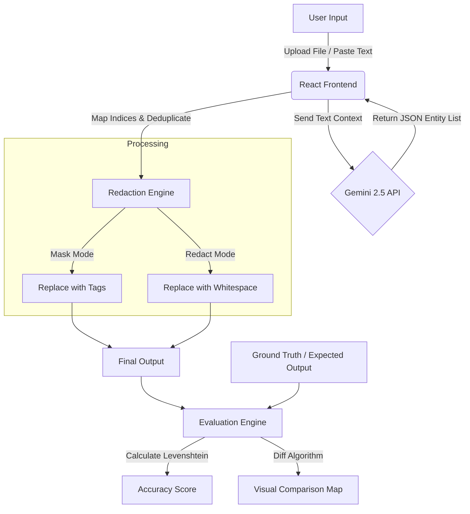

# Universe Redaction Tool 

> **Next-Generation Intelligent Data Loss Prevention (DLP) System**

[](https://genuine-sopapillas-530bd0.netlify.app/)
[](https://ai.google.dev/)
[](https://react.dev/)

**Universe Redaction Tool** is a sophisticated cybersecurity utility designed to automatically detect and redact Personally Identifiable Information (PII) from unstructured text. Leveraging the advanced reasoning capabilities of the **Google Gemini 2.5 API**, it balances privacy protection with contextual integrity.

---

##  Live Demo

**Access the application here:** [https://genuine-sopapillas-530bd0.netlify.app/](https://genuine-sopapillas-530bd0.netlify.app/)

---

##  Key Features

-   **Intelligent Entity Detection**: Identifies 8+ types of PII including Names, IPs, Emails, Credit Cards, and Locations using LLM reasoning.
-   **Dual Redaction Modes**:
    -   **Mask Mode**: Replaces text with entity tags (e.g., `[EMAIL_ADDRESS]`).
    -   **Redact Mode**: Replaces text with whitespace to maintain visual document structure.
-   **Accuracy Evaluation Suite**:
    -   Levenshtein Distance calculation for similarity scoring.
    -   Visual "Diff" interface highlighting mismatches (Red) vs. matches (Green).
    -   Side-by-side comparison with Ground Truth data.
-   **Modern UI/UX**:
    -   "Deep Space" Glassmorphism aesthetic.
    -   Fully responsive Dark/Light theme.
    -   Real-time statistics dashboard.

---

##  Architecture & Workflow

The system follows a modern client-side architecture where the frontend handles logic, state management, and visualization, while the Gemini API serves as the intelligence engine.



---

##  Project Structure

```text
/
├── index.html                 # Entry point & Tailwind Config
├── index.tsx                  # React DOM Root
├── App.tsx                    # Main Application Controller
├── types.ts                   # TypeScript Interfaces & Enums
├── metadata.json              # App Configuration
│
├── services/
│   └── geminiService.ts       # Gemini API Integration & System Instructions
│
├── utils/
│   └── textProcessing.ts      # Levenshtein Algo, Redaction Logic, Index Mapping
│
└── components/
    ├── EntityTable.tsx        # Floating Data Panel for Detected Entities
    ├── EvaluationView.tsx     # Visual Diff & Accuracy Pie Charts
    └── StatsDashboard.tsx     # Real-time Bar Charts & KPI Cards
```

---

##  Technology Stack

-   **Frontend Framework**: React 19 (Hooks, Context API)
-   **Language**: TypeScript (Strict typing for robustness)
-   **AI Engine**: Google GenAI SDK (`@google/genai`)
-   **Styling**: Tailwind CSS (Custom "Universe" configuration)
-   **Visualization**: Recharts (Responsive data visualization)
-   **Utilities**: 
    -   `diff`: For character-level text comparison.
    -   `lucide-react`: Modern vector iconography.

---

##  Setup & Installation

To run this project locally:

1.  **Clone the repository**
    ```bash
    git clone https://github.com/your-username/universe-redaction-tool.git
    cd universe-redaction-tool
    ```

2.  **Install dependencies**
    ```bash
    npm install
    ```

3.  **Configure Environment**
    Create a `.env` file in the root directory and add your Google Gemini API Key:
    ```env
    API_KEY=your_actual_api_key_here
    ```

4.  **Run Development Server**
    ```bash
    npm run dev
    ```

---

##  Evaluation Methodology

The system's accuracy is measured using a modified **Levenshtein Distance** algorithm.

1.  **Normalization**: Both the *System Output* and *Expected Output* are normalized (excess whitespace removed).
2.  **Distance Calculation**: The number of single-character edits (insertions, deletions, substitutions) required to change one string into the other is calculated.
3.  **Similarity Score**:
    $$ \text{Similarity} = \left( 1 - \frac{\text{Distance}}{\text{MaxLength}} \right) \times 100 $$

---

## 📝 License

This project is open-source and available under the [MIT License](LICENSE).

---

*Designed & Engineered for the Cybersecurity Hackathon.*
